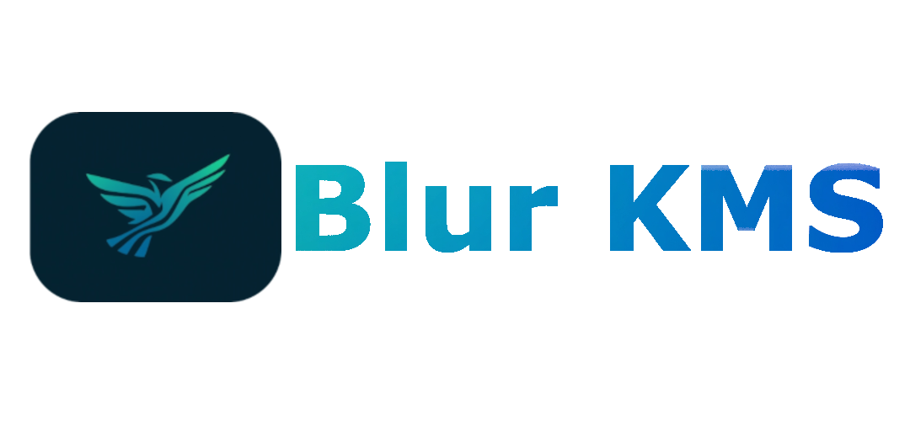

<h1 align="center">Blur_KMS</h1>
<p align="center">Blur-KMS es una herramienta de línea de comandos diseñada para facilitar la Instalacion de Claves KMS de Windows y Office mediante KMS (Key Management Service).</p>

<p align="center">
  <a href="#############"></a><br>
  <a href="https://github.com/NesANTIME"> </a>
</p>

Para mas informacion puede visitar la pagina de <a href="https://nesantimeproyect.netlify.app/proyectos/blurkms">¡novedades!</a> 

<br></br>

## 📋 Descripción
Herramienta de línea de comandos diseñada para **facilitar** la Instalacion de **Claves KMS** de Windows y Office mediante `KMS (Key Management Service)`.

Esta herramienta esta diseñada en el lenguaje de programacion Python por lo que en versiones anteriores a la v5.0 es nesesario instalar en el sistema el interprete de Python, disponible en su <a href="https://www.python.org/downloads/">sitio oficial</a>.


> **⚠️ Nota Importante:** 
>Tenga en cuenta que el uso de claves KMS no oficiales para activar productos de Microsoft es una violación de sus términos de servicio y puede ser ilegal en muchas regiones, Por esta Razon Blur-KMS ultiliza <a href="https://learn.microsoft.com/es-es/windows-server/get-started/kms-client-activation-keys?tabs=server2025%2Cwindows1110ltsc%2Cversion1803%2Cwindows81">Claves KMS proporcionadas por Microsoft</a>, si quiere saber mas puede visitar la <a href="https://nesantimeproyect.netlify.app/proyectos/v/blur_kms/documentacion">documentacion de BlurKMS</a>.


<br></br>

## 📓 Características de Blur-KMS

#### 🛠️ Instalación de Claves KMS **Compatible con:**
> - 🪟 **Windows** (10, 11)

> - 📦 **Office** (2016, 2019, 2021)
  

<br></br>

## 📲 Instalación
Instrucciones paso a paso sobre cómo instalar y ejecutar Blur-KMS.
```bash
# 📥 Descargar el Programa:
Descarga la última versión Disponible/Estable disponible.

# 📂 Ingresar al Directorio:
Descomprime el archivo ".zip" descargado y entra a la carpeta llamada: "Blur-KMS".

# ⚙️ Ejecutar el Programa:
Ejecuta el archivo "BlurKMS.exe" para iniciar Blur_KMS.  

    → Luego, elige la opción que necesites.
```

## 🧑‍⚖️ Modo de uso y Advertencias
El menú del Programa Principal (Blur.py) es muy sencillo y se puede entender a primera vista. Puede Selecionar entre diferentes modos de Activacion de productos KMS.

>#### ***🗒️ NOTA:*** 
>*El programa no se ejecutara si no le brinda permisos de administracion, `Blur-KMS` Tratara de Obtener Su Permiso (Acepte los permisos para evitar errores).*

<br></br>

# ©️ Licencia 
®️ [LISENCE](LISENCE.md) by [NesAnTime](https://github.com/NesANTIME)