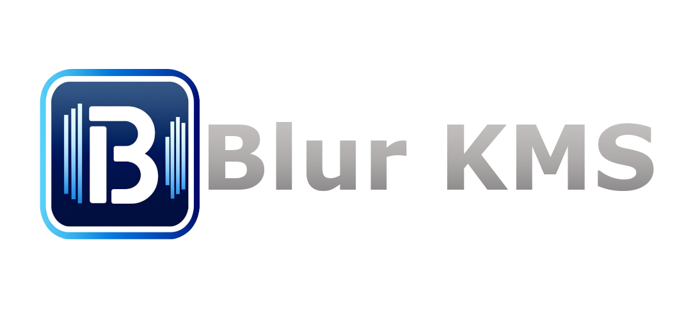

<h1 align="center">Blur_KMS</h1>
<p align="center">Blur-KMS es una herramienta de línea de comandos diseñada para facilitar la Instalacion de Claves KMS de Windows y Office mediante KMS (Key Management Service).</p>

<p align="center">
  <a href="#############"></a><br>
  <a href="https://github.com/NesANTIME"> </a>
</p>

<details>
  <summary>🚀 Mas detalles sobre Actualizaciones <a>(click aqui)</a></summary>

  <br>

*<h5>⬆️ 📆 Actualizaciones Mas recientes</h5>* 
<a href = "https://nesantimeproyect.blogspot.com/p/blurkms-v40-que-hay-de-nuevo.html">*<u>Click</u> Para ver mas cambios, mejoras y diferencias  entre BlurKMS v3.3 y v4.1*</a>

```bash
# Version 4.0 Oficial --- PUBLICADA
 ⚠️ "Actualizaciones Lanzador BlurKMS v4.0: "
   📲 Actualizacion Lanzador Blur_KMS (Usa Aplicacion .exe para mas versatilidad.)

 ⚠️ "NOVEDADES BlurKMS v4.0:" 
    ℹ️ "BlurKMS v4.1:" Parche de Errores en activacion de Office.

    ➡️ Aumento de Seguridad
       🔜 shlex.split() en Command() para evitar ejecución arbitraria de comandos maliciosos (💣 inyección de comandos).
       🔜 Se Integro un verificador de archivos que permite la buena ejecucion de BlurKMS ante perdida o borrado de archivos.

    ➡️ Gestión de configuración.
       🔜 Usa un archivo JSON para guardar informacion importante.

    ➡️ Verificación de actualización.
       🔜 Carga las versiones desde el mismo JSON remoto y local.

    ➡️ Modularidad y Mantenimiento.
       🔜 Separa claramente los datos (JSON) de la lógica (Python).
       🔜 Define Load_BD() como cargador central de toda la base de datos.

    ➡️ Ejecución de comandos.
       🔜 Command() más robusta, permite múltiples modos con seguridad, y es extensible.
       🔜incluye detección del sistema operativo con platform.system() en clear(), mejor portabilidad.
    

# Version 3.3 Oficial --- FINALIZADA/FIN_SOPORTE
 ⚠️ "Actualizaciones/Parches Lanzador BlurKMS v3.4: "
    📲 Actualizacion/Parche de Errores Lanzador (Correccion de funciones)

 ⚠️ "NOVEDADES BlurKMS v3.3:" 
    ➡️ Reduccion de Requisitos de Uso (No es Nesesario 
         Intalar Python Manualmente).
    ➡️ Rediseño en el apartado visual.
    ➡️ Mejoras en errores visuales.
    ➡️ Rediseño de pagina de claves genericas de office.
    ➡️ Manejo de errores pulido.
    ➡️ Animacion de inicio.
```

<a href = "https://nesantimeproyect.blogspot.com/p/blurkms-v40-que-hay-de-nuevo.html">*<u>Click</u> Para ver mas cambios, mejoras y diferencias  entre BlurKMS v3.3 y v4.1*</a>
</details>

<br></br>

## 📋 Descripción
Herramienta de línea de comandos diseñada para **facilitar** la Instalacion de **Claves KMS** de Windows y Office mediante `KMS (Key Management Service)`.

Esta Herramienta esta diseñada en el lenguaje de programacion **Python** por lo que es **nesesario instalar** el <a href="https://www.python.org/downloads/">Programa/Interprete Python</a> en el sistema, por lo cual el interprete Python v3.12.3 puede ser descargado e instalado desde el Lanzador de Blur-KMS y ahorrarse tiempo, cabe aclarar que tambien puede instalarlo manualmente.


> **⚠️ Nota Importante:** 
>Tenga en cuenta que el uso de claves KMS no oficiales para activar productos de Microsoft es una violación de sus términos de servicio y puede ser ilegal en muchas regiones, Por esta Razon Blur-KMS ultiliza <a href="https://learn.microsoft.com/es-es/windows-server/get-started/kms-client-activation-keys?tabs=server2025%2Cwindows1110ltsc%2Cversion1803%2Cwindows81">Claves KMS proporcionadas por Microsoft</a>.


<br></br>

## 📓 Características de Blur-KMS

#### 🛠️ Instalación de Claves KMS **Compatible con:**
> - 🪟 **Windows** (10, 11)

> - 📦 **Office** (2016, 2019, 2021)
  

<br></br>

## 📝 Requisitos
> - Python 3.12.x (Posteriores) - [Descargar Aqui](https://www.python.org/downloads)
> - Ejecutar Como Administrador (Evitar Errores)

## 📲 Instalación
Instrucciones paso a paso sobre cómo instalar y ejecutar Blur-KMS.
```bash
# 📥 Descargar el Programa:
Descarga la última versión Disponible/Estable disponible.
    "→ ¿Quieres probar versiones en desarrollo?" 
       Descarga desde el apartado Código fuente 
       (Beta/Alfa).

# 📂 Ingresar al Directorio:
Descomprime el archivo ".zip" descargado y entra a la carpeta llamada: "Blur-KMS".

# ⚙️ Ejecutar el Programa:
Ejecuta el archivo "LanzadorBlur.exe" Para Iniciar el Lanzador de Blur_KMS.  

    → Luego, elige la opción que necesites.
```

## 🧑‍⚖️ Modo de uso y Advertencias
El menú del Programa Principal (Blur.py) es muy sencillo y se puede entender a primera vista. Puede Selecionar entre diferentes modos de Activacion de productos KMS.

>#### ***🗒️ NOTA 1:*** 
>*El Programa No se Ejecutara Si no le brinda permisos de administracion, `Blur-KMS` Tratara de Obtener Su Permiso (Acepte los permisos para evitar errores).*

>#### ***🗒️ NOTA 2:***  
>*La Herramienta Instalara Automaticamente La Libreria Colorama & Pillow, Unas Librerias de Python Meramente Esteticas.*

>#### ***🗒️ NOTA 3:*** 
>*Si al Ejecutar `Executable.bat` y Elejir la opcion 1 (Ejecutar Blur), Lanza cualquier error y ya instalo python, lo mas probable es que no se instalaron automaticamente las librerias nesesarias para que el programa funcione, estas son Colorama & Pillow. (Si Continua Fallando Instalelas manualmente).*

>#### ***🗒️ NOTA 4:***  
>*Un problema comun es al finalizar la instalacion de python, este no se agrege automaticamente al PACH de windows y tendra que moverlo manualmente al PACH.*

>#### ***🗒️ NOTA 5:***  
>*Otro problema comun es que Python no se instale correctamente o no se instale directamente atravez del `lanzador de Blur_KMS` ya que windows puede poner restricciones a los `.bat` descargados de internet o sin firma valida.*

<br></br>

# ©️ Licencia 
*<h3>📋 De Uso Libre, Prohibido de Modificacion y/o Venta de este.</h3>*

®️ by [NesAnTime](https://github.com/NesANTIME)